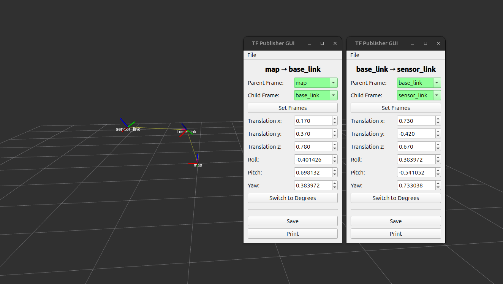

# TF Publisher GUI for ROS2

This is a simple tool for publishing a tf transformation that can be adjusted in real time. Initially built for calibrating LiDAR sensor positions.


Current version is tested on humble and jazzy.



<<<<<<< HEAD
=======
## LiDAR Calibration Demo

Check out this video demonstration of the LiDAR Calibration process using the TF Publisher GUI:

[](https://youtu.be/qO0II-0Jsa4)

>>>>>>> parent of 4f02c6f (Fixed video embed)
## Installation
To install this package into your ROS2 workspace, follow these steps:

1. Clone the repository into your workspace's `src` directory:
    ```sh
    cd /path/to/your/ros2/workspace/src
    git clone https://github.com/ilipponen/tf_publisher_gui.git
    ```

2. Navigate to the root of your workspace:
    ```sh
    cd /path/to/your/ros2/workspace
    ```

3. Install any dependencies using `rosdep`:
    ```sh
    rosdep update
    rosdep install --from-paths src --ignore-src -r -y
    ```

4. Build the workspace:
    ```sh
    colcon build
    ```

5. Source the setup file:
    ```sh
    source install/setup.bash
    ```

Now you should be able to run the TF Publisher GUI.

## Usage

Basic usage can be done with
```sh
ros2 run tf_publisher_gui tf_publisher_gui
```

You can also specify parameters for launch
```sh
ros2 run tf_publisher_gui tf_publisher_gui \
    --ros-args \
    -p parent_frame:=parent_link \
    -p child_frame:=child_link \
    -p x:=0.0 \
    -p y:=0.0 \
    -p z:=0.0 \
    -p roll:=0.0 \
    -p pitch:=0.0 \
    -p yaw:=0.0 \
    -p hz:=10
```

### Parameter Descriptions

- `parent_frame`: The name of the parent frame (default: `parent_link`).
- `child_frame`: The name of the child frame (default: `child_link`).
- `x`: The x-coordinate of the transformation (default: `0.0`).
- `y`: The y-coordinate of the transformation (default: `0.0`).
- `z`: The z-coordinate of the transformation (default: `0.0`).
- `roll`: The roll angle of the transformation in radians (default: `0.0`).
- `pitch`: The pitch angle of the transformation in radians (default: `0.0`).
- `yaw`: The yaw angle of the transformation in radians (default: `0.0`).
- `hz`: The frequency at which the transformation is published in Hz (default: `10`).
